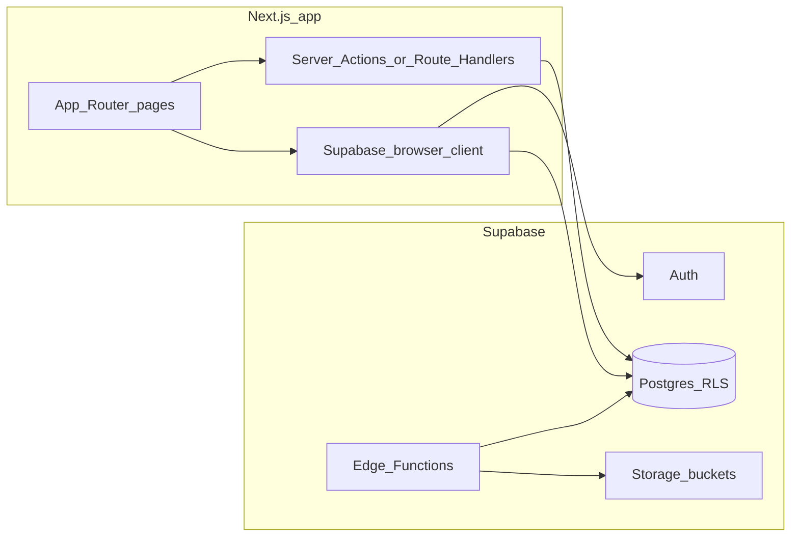

# Implementation plan: Supabase backend + dashboards

**Deliverable file:** After you approve this plan in Agent mode, write it to the repo root as [`IMPLEMENTATION_PLAN.md`](/Users/tariqkichawele/Desktop/fitness_trainer_portfolio/IMPLEMENTATION_PLAN.md) (you asked for this filename explicitly).

**Assumptions (questions were skipped):**

- **Calendar model:** Start with **session types (catalog)** + **scheduled occurrences** (each row is a bookable event with `starts_at` / `ends_at`). Add **recurrence** in a later phase only if needed (keeps v1 shippable while matching “availability for a period / ongoing”).
- **Admin access (first wave):** **Manual only** — insert `admin` into `user_roles` in Supabase SQL/dashboard after tables exist (**§0 step C**). Later optional: `ADMIN_EMAILS` env allowlist for staging, or invite-only Edge Function.
- **Single business / single trainer** for v1 (schema can keep `trainer_id` nullable UUID for future multi-trainer without a big rewrite).

**Framework note:** This repo uses **Next.js 16** and **React 19** ([`package.json`](/Users/tariqkichawele/Desktop/fitness_trainer_portfolio/package.json)). Before implementing server/auth patterns, read the local Next guide under `node_modules/next/dist/docs/` (per [`AGENTS.md`](/Users/tariqkichawele/Desktop/fitness_trainer_portfolio/AGENTS.md)) because APIs differ from older Next versions.

---

## 0. First execution wave (agreed order — implement before broader scope)

Ship in this order so you can **manually create the admin** in Supabase and **smoke-test roles** before building real booking/session UIs.

| Step | What | Done when |
|------|------|-----------|
| **A. Supabase + all tables** | Supabase project (hosted or local), `supabase/migrations/*` in git, **full v1 schema from §6** (profiles, `user_roles`, session types/occurrences, bookings, availability, history tables as defined — migrations can create tables with minimal RLS first, then tighten). `auth.users` → **`profiles`** + default **`user_roles.role = user`** trigger (or equivalent `on_auth_user_created`). | `supabase db push` / dashboard apply succeeds; tables visible in Table Editor |
| **B. Signup + login** | Next: `@supabase/supabase-js`, `@supabase/ssr`, `middleware.ts` session refresh, Route Handler or app route for **`/auth/callback`**, pages **`/login`**, **`/signup`**, sign-out. Use **email + password** (and/or magic link) per Supabase Auth settings. | New user appears in Auth + `profiles` + `user_roles` as `user` |
| **C. Roles — manual admin** | **Do not** auto-promote admins in app for this wave unless you later re-enable `ADMIN_EMAILS`. After **A** is live: create or pick a user in **Authentication**, copy their UUID, **`insert into user_roles (user_id, role, …)` with `role = 'admin'`** in SQL Editor (and ensure only one logical “primary” admin row per user if you use single-row semantics). Document exact SQL in README or `IMPLEMENTATION_PLAN.md`. | That user’s JWT/session can read admin-only policies |
| **D. Mock dashboards** | **`/admin`** — placeholder layout (cards, nav shell), **RLS + middleware**: only `admin` role. **`/dashboard`** (or **`/client`**) — placeholder “User dashboard” for any signed-in **non-admin** (or all authenticated users initially; refine to `client` later). **`/unauthorized`** for wrong role. Optional: link from landing Navbar to Login. | Signup → lands on user mock; manual admin → lands on admin mock; cross-visit → 403/unauthorized |

**Out of scope for this wave:** Real session/booking CRUD, CSV reports, Sonner/shadcn polish (can follow immediately after D), history triggers beyond what’s needed for inserts.

---

## 1. Current baseline (what you have)

- Static marketing site: [`app/page.tsx`](/Users/tariqkichawele/Desktop/fitness_trainer_portfolio/app/page.tsx), landing components under [`components/landing/`](/Users/tariqkichawele/Desktop/fitness_trainer_portfolio/components/landing/), copy in [`lib/trainer-content.ts`](/Users/tariqkichawele/Desktop/fitness_trainer_portfolio/lib/trainer-content.ts).
- **Brand tokens** already in [`app/globals.css`](/Users/tariqkichawele/Desktop/fitness_trainer_portfolio/app/globals.css): `--accent` green, Geist fonts via layout, light/dark via `prefers-color-scheme`.
- **No** `@supabase/supabase-js`, **no** shadcn/ui yet — both are planned additions.

---

## 2. Target architecture

- **Browser:** Supabase client for auth session and user-scoped reads where safe.
- **Server:** Prefer **Route Handlers** and/or **Server Actions** (per Next 16 docs) for mutations that need service role *only* when absolutely necessary; default path is **user JWT + RLS**.
- **Edge Functions:** Webhooks, heavy validation, cross-table workflows (e.g. “cancel occurrence + notify + audit”), and **admin-only** operations that are awkward in pure SQL.

---

## 3. Information architecture (routes / pages)

Use **App Router** route groups for layout and guards.

| Area | Suggested routes | Purpose |
|------|------------------|---------|
| **Public** | `/`, `/login`, `/signup`, `/auth/callback` (or framework-equivalent), `/legal/privacy`, `/legal/terms` | Marketing + auth flows |
| **Account (any signed-in)** | `/me` or `/account/profile`, `/account/security` | Profile, avatar, password/magic link management |
| **Client** | `/client`, `/client/bookings`, `/client/bookings/[id]` | Dashboard + booking list + booking detail (slug/id) |
| **Admin** | `/admin`, `/admin/sessions` (types list), `/admin/sessions/types/[slugOrId]`, `/admin/calendar` (or `/admin/schedule`), `/admin/bookings`, `/admin/bookings/[id]`, `/admin/clients`, `/admin/clients/[userId]`, `/admin/reports`, `/admin/settings` | Operations hub |
| **Staff-only utilities** | `/admin/settings/roles` (optional subpage) | Ban/reject, audit filters |

**Additional pages worth adding (recommended):**

- **`/book`** or **`/sessions`**: public browsable upcoming occurrences (drives conversion; can require login to confirm).
- **`/client/onboarding`**: post-signup “complete profile” (**address line 1, line 2, post code, phone number**—same fields as `profiles`; optional: emergency contact, waivers later).
- **`/admin/audit`**: searchable login + domain event log (admins).
- **`/forgot-password`** / **`/reset-password`**: if you support password auth (even if primary is magic link).
- **`/unauthorized`**: friendly 403 for wrong role.

**UI/UX rules (your preferences encoded in the plan):**

- **User-specific flows:** dedicated routes with stable URLs (`/client/bookings/[id]`, `/admin/clients/[userId]`), not giant modal workflows.
- **Modals:** confirmations, small edits (e.g. quick status change), destructive actions.
- **Toasts:** top-left stack; implement via **shadcn Sonner** (or shadcn Toast) with `position="top-left"` and one provider in root layout for app sections.

---

## 4. Branding guide (derive from current landing + shadcn)

**Color & surfaces (from [`app/globals.css`](/Users/tariqkichawele/Desktop/fitness_trainer_portfolio/app/globals.css)):**

- **Background:** `background` — keep large areas calm (off-white / near-black in dark).
- **Text:** `foreground` primary; `muted` for secondary labels.
- **Primary CTA / success / fitness accent:** `accent` / `accent-muted` — use for primary buttons, key stats, active nav indicator.
- **Borders/cards:** `border`, `card` — tables, panels, sidebar.

**Typography:**

- Keep **Geist Sans** for UI body; **Geist Mono** for IDs, timestamps in admin tables.

**Components (shadcn as reference):**

- Initialize shadcn for Next + Tailwind 4 per current shadcn/Tailwind v4 guidance at implementation time.
- Standard kit: `Button`, `Input`, `Label`, `Select`, `Dialog`, `DropdownMenu`, `Tabs`, `Table`, `Badge`, `Card`, `Sheet` (mobile nav), `Calendar` + `Popover` (admin scheduling), `Form` + zod resolver.

**Layout patterns:**

- **Public pages:** full-bleed hero (reuse landing rhythm).
- **App shells (client/admin):** left sidebar + top bar (user menu, role badge, environment chip in non-prod). Content max-width readable for reports; tables full width.

**Motion:** subtle only (150–200ms); respect `prefers-reduced-motion`.

---

## 5. Supabase project setup (step-by-step)

1. Create Supabase project; note **project URL**, **anon key**, **service role key** (server-only).
2. Enable **Auth** providers you need (recommend **magic link** + optional **password** for clients who prefer it).
3. Install `@supabase/supabase-js` + `@supabase/ssr` (or current recommended SSR package for Next 16 — confirm in Supabase Next.js guide at implementation time).
4. Add env vars to `.env.local` (and Vercel/hosting): `NEXT_PUBLIC_SUPABASE_URL`, `NEXT_PUBLIC_SUPABASE_ANON_KEY`, `SUPABASE_SERVICE_ROLE_KEY` (never exposed), optional `ADMIN_EMAILS`.
5. **Local DX:** Supabase CLI for migrations (`supabase/migrations/*.sql`) versioned in git.

---

## 6. Data model (Postgres tables)

Below is a **v1 schema** that satisfies CRUD for types + occurrences, bookings, roles, bans, availability, and rich history. Use UUID PKs, `timestamptz`, and enums as Postgres enums or `text` + check constraints.

### 6.1 Core identity & roles

| Table | Purpose |
|-------|---------|
| **`profiles`** | `id` (FK `auth.users.id`), `display_name`, `avatar_url`, **`phone_number`**, **`address_line_1`** (add1), **`address_line_2`** (add2), **`post_code`**, `created_at`, `updated_at`, `status` (`active` / `rejected` / `banned`), `ban_reason`, `banned_at`, `banned_by` (FK profiles) |

**Profile contact & address (standard columns):** All four are `text`, **nullable** in the database unless product rules require them before first booking (enforce in app + optional DB check later). Use **`address_line_1`** / **`address_line_2`** for two address lines; **`post_code`** for postal/ZIP; **`phone_number`** for contact phone (store normalized E.164 in app if desired, or raw string + country in a later phase).
| **`user_roles`** | `user_id`, `role` (`user` / `client` / `admin`), `granted_at`, `granted_by` — multi-row if you want audit of promotions; or single `role` on `profiles` + **`role_change_log`** (recommended separate log) |

**Role rules (business logic):**

- New signup → insert `profiles` + default role **`user`** in `user_roles` (or `profiles.role`).
- On **first successful booking** (confirmed state — define below) → promote to **`client`** (transactional update + log).
- **Admin** assign/revoke only via admin UI backed by RLS-safe RPC or Edge Function.
- **Reject/ban:** set `profiles.status`, optionally revoke refresh tokens via Edge Function (service role) for immediate logout.

### 6.2 Session catalog (“session types”) vs schedule (“occurrences”)

| Table | Purpose |
|-------|---------|
| **`session_types`** | `slug` (unique), `title`, `description`, `category`, `default_duration_min`, `default_max_slots`, `default_price_cents`, `default_location`, `is_active`, `created_at`, `updated_at` |
| **`session_occurrences`** | `id`, `session_type_id` (nullable if ad-hoc), `title_override`, `description_override`, `starts_at`, `ends_at`, `max_slots`, `price_cents`, `location`, `status` (`scheduled` / `cancelled` / `completed`), `cancel_reason`, `cancelled_at`, `cancelled_by`, `notes` (admin internal) |

Indexes: `(starts_at)`, `(session_type_id, starts_at)`, partial index on `status = 'scheduled'`.

### 6.3 Availability rules & exceptions

| Table | Purpose |
|-------|---------|
| **`availability_rules`** | Scope: `session_type_id` **or** global (`session_type_id` null). Fields: `valid_from`, `valid_to` (nullable = open-ended / “ongoing”), `weekday_mask` or `rrule` **if** you add recurrence later; for v1 a simple **`is_published`** + date range + optional “repeat weekly on DOW” is enough. |
| **`availability_exceptions`** | `date` (or `starts_at`), `scope` (global or per type), `kind` (`blackout` / `extra_hours`), `note` |

**Clarifying behavior in app:** “Active for a period” = occurrences only generated/visible inside window; “ongoing” = `valid_to` null. If you do **not** auto-generate occurrences in v1, admins **manually create** occurrences and the “rule” table mainly drives **visibility/eligibility** on the public `/book` page — still valuable.

### 6.4 Bookings

| Table | Purpose |
|-------|---------|
| **`bookings`** | `id`, `user_id`, `session_occurrence_id`, `status` (`pending` / `confirmed` / `cancelled_by_client` / `cancelled_by_admin` / `no_show` / `attended`), `created_at`, `updated_at`, `cancel_reason`, `cancelled_at`, `cancelled_by` |
| **Unique partial index:** one **active** booking per user per occurrence (where `status` in pending/confirmed). |

**No online payments:** add nullable `payment_status` (`unpaid` / `paid_on_site` / `waived`) and `payment_note` for admin reconciliation — no Stripe.

### 6.5 History / audit (append-only)

| Table | Purpose |
|-------|---------|
| **`auth_login_history`** | `id`, `user_id` nullable for failed, `event` (`login_success` / `login_failure` / `logout` / `token_refresh`), `ip`, `user_agent`, `created_at`, `metadata` jsonb |
| **`session_occurrence_history`** | Row-level changes to occurrences (who/when/diff or before/after jsonb) |
| **`booking_history`** | Booking status transitions with reasons |
| **`admin_action_log`** | Generic: `actor_id`, `action`, `entity_type`, `entity_id`, `payload` jsonb |
| **`role_change_log`** | From → to role, actor, reason |

**Implementation mechanism (pick one, can combine):**

- **Triggers** on `bookings`, `session_occurrences`, `profiles` → insert into `*_history` tables (reliable, always on).
- **Edge Function** for complex flows where you want one atomic narrative (e.g. cancel class + bulk-cancel bookings).

**Other history to track (recommended):**

- **Email / notification attempts** (later): `notification_log`.
- **Profile changes** (PII): `profile_change_log` — include **phone_number** and **address_line_1/2/post_code** when auditing edits (hash or redact in exports if needed).
- **File uploads** to Storage: `media_assets` table + metadata (who uploaded, bucket path, visibility).

### 6.6 Media (Supabase Storage)

Buckets (private by default):

- **`avatars`** — public read optional, or signed URLs.
- **`admin-uploads`** — session images, PDF waivers (future).

RLS policies on `storage.objects` tied to folder prefix = `auth.uid()`.

---

## 7. Row Level Security (RLS) outline

**Principles:**

- **Clients** read/update **their** `profiles` (non-privileged columns), read **published** occurrences, CRUD **their** bookings within allowed transitions.
- **Admins** bypass via `is_admin()` SQL helper reading `user_roles` **or** JWT custom claims (claims require sync job — **v1: use RLS + `user_roles` table**).
- **Banned/rejected** users: policy denies all except read minimal “account suspended” message.

**Key policies:**

- `session_occurrences`: public/authenticated `select` for future `scheduled` rows; only admin `insert/update/delete`.
- `bookings`: user `select/insert` own; user `update` only to cancel within rules; admin full.
- `profiles`: user self-read/update **own** contact/address columns (`phone_number`, `address_line_1`, `address_line_2`, `post_code`, `display_name`, `avatar_url`); admin read all + update **status / ban** fields (and optionally support overrides for corrections via admin UI + `admin_action_log`).

**Security definer RPCs (examples):**

- `request_booking(occurrence_id)` — checks capacity, time window, user status, ban list; inserts `pending` or `confirmed`.
- `confirm_booking(booking_id)` — admin/staff.
- `cancel_booking(booking_id, reason)` — role-aware.

---

## 8. Edge Functions (when to use)

| Function | Role |
|----------|------|
| **`auth-hook` / HTTP webhook** (if Supabase Auth hooks available in your tier) | Record `auth_login_history` on sign-in events |
| **`on-user-created`** | Create `profiles`, default role `user` |
| **`admin-set-role`** | Validates caller is admin; writes `user_roles` + log |
| **`admin-ban-user`** | Updates profile, optional forced sign-out |
| **`cancel-occurrence`** | Bulk-updates bookings + logs + notifications later |

If Auth webhooks are not used, fallback: log **app-level** sign-in in Next middleware/route after session refresh (less complete than server-side auth events).

---

## 9. Next.js app integration steps

1. **Supabase clients:** `lib/supabase/server.ts`, `lib/supabase/client.ts`, `middleware.ts` for session refresh (pattern from Supabase + Next docs).
2. **Auth callback route:** exchange code, set cookies.
3. **Route protection:** middleware matcher for `/client/*`, `/admin/*`, `/account/*` — redirect unauthenticated to `/login`; redirect wrong role to `/unauthorized`.
4. **Data fetching:** Server Components fetch read-only lists; mutations via Server Actions calling Supabase with user context.
5. **Forms:** `react-hook-form` + zod shared schemas in `lib/validators/*`.
6. **shadcn + Sonner** in [`app/layout.tsx`](/Users/tariqkichawele/Desktop/fitness_trainer_portfolio/app/layout.tsx) (consider a nested `app/(app)/layout.tsx` so marketing layout stays minimal).

---

## 10. Admin / client feature breakdown (screens)

**Admin dashboard (`/admin`):** KPIs — upcoming classes this week, bookings today, new users awaiting approval (if you add approval), revenue **not** from Stripe but “expected on-site” sum from confirmed bookings’ `price_cents`.

**Session types CRUD:** table + `/admin/sessions/types/new`, `/admin/sessions/types/[slug]`.

**Occurrences / calendar:** week view; create/edit occurrence pages; cancel with reason modal.

**Bookings:** filter by status/date; booking detail with timeline from `booking_history`.

**Clients:** directory, profile detail (**show/edit policy:** clients edit own address/phone on `/account/profile`; admins view full address + phone on `/admin/clients/[userId]` for operational contact), role badges, ban/reject with reason modal.

**Reporting:** exports (CSV) for bookings by date range, attendance, cancellations; charts optional phase 2.

**Settings:** business timezone, locations list, session categories, default buffers, `ADMIN_EMAILS` documentation (not editable in UI unless you want).

**Client dashboard:** next booking, quick link to book more.

**Client booking management:** list + detail with cancel policy (simple v1: cancel until X hours before start, stored on `session_types` or global settings).

---

## 11. Migration from static [`lib/trainer-content.ts`](/Users/tariqkichawele/Desktop/fitness_trainer_portfolio/lib/trainer-content.ts)

1. Seed `session_types` + a few `session_occurrences` from existing static `sessions` array for demo parity.
2. Refactor landing **WeeklySchedule** to read from Supabase (public read) or hybrid: build-time static until DB ready.
3. Keep `trainerName` / marketing copy in code or move to `site_settings` table (optional).

---

## 12. Testing & quality gates

- **RLS tests:** use Supabase local stack + pgTAP or integration tests hitting anon key as different users.
- **E2E:** Playwright for signup → book → admin cancel flow (add when stable).
- **Lint/typecheck** in CI; `next build` must pass.

---

## 13. Phased delivery (recommended order)

| Phase | Outcome |
|-------|---------|
| **§0 / Wave A–D** | **(Current priority)** All tables + migrations; signup/login/logout; **manual** admin `user_roles`; **mock** `/admin` + user `/dashboard` (or `/client`) + `/unauthorized`; minimal RLS to prove role separation |
| **P0 (polish)** | shadcn + Sonner top-left, app shell layout, `/account/profile` with address + phone fields, env docs `.env.example` |
| **P1** | Session types + occurrences CRUD (admin), public schedule read, client booking create/cancel |
| **P2** | Auto `user` → `client` on first confirmed booking; admin clients list, ban/reject, booking admin tools |
| **P3** | Availability rules/exceptions affecting visibility |
| **P4** | History completeness (triggers), reporting CSV, audit viewer |
| **P5** | Storage avatars, polish, performance indexes |

---

## 14. Improvements beyond your list (prioritized)

- **Waitlist** when occurrence is full (`waitlist_entries` table).
- **Check-in** flow for admin (`attended` / `no_show`) from mobile-friendly admin page.
- **Cancellation policy** per session type (hours before start).
- **Session venue vs home address:** `profiles` holds **client home/contact address**; session **venue** stays on `session_types` / `session_occurrences` (`location` + optional structured venue fields later if “Studio”/“Outdoor” becomes insufficient).
- **GDPR/export**: user data export Edge Function.
- **Rate limiting** on booking RPC to prevent abuse.

---

## 15. When you want to add Stripe later

Keep `price_cents` and booking states; add `stripe_customer_id` on `profiles`, `payments` table, webhooks Edge Function — **out of scope** until you explicitly greenlight.

---

## 16. Post-approval action (Agent mode)

1. Sync this plan into repo-root [`IMPLEMENTATION_PLAN.md`](/Users/tariqkichawele/Desktop/fitness_trainer_portfolio/IMPLEMENTATION_PLAN.md) when requested.
2. Do **not** commit secrets; add `.env.example` documenting `NEXT_PUBLIC_SUPABASE_URL`, `NEXT_PUBLIC_SUPABASE_ANON_KEY`, optional `SUPABASE_SERVICE_ROLE_KEY` (server-only).
3. Implement in order **§0 steps A → B → C (docs + manual SQL) → D**, using `node_modules/next/dist/docs/` for Next 16 auth/cookies/middleware patterns.
4. After **D** passes manual smoke tests, continue **P0–P1** from the table in §13.
